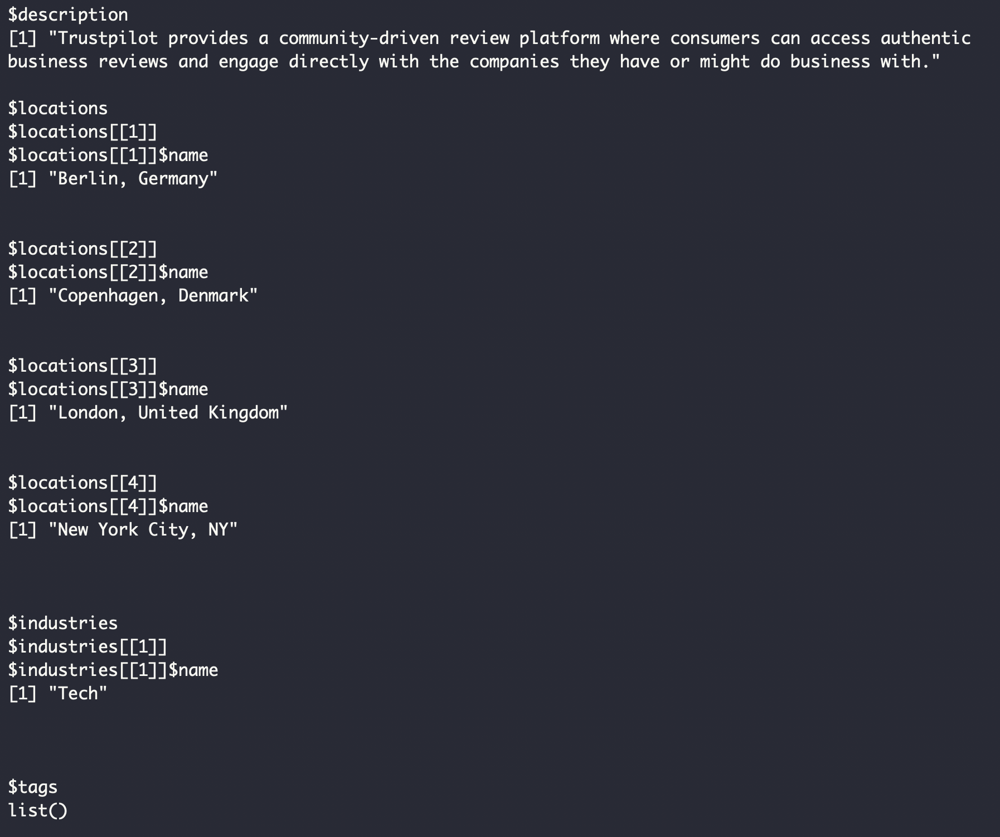
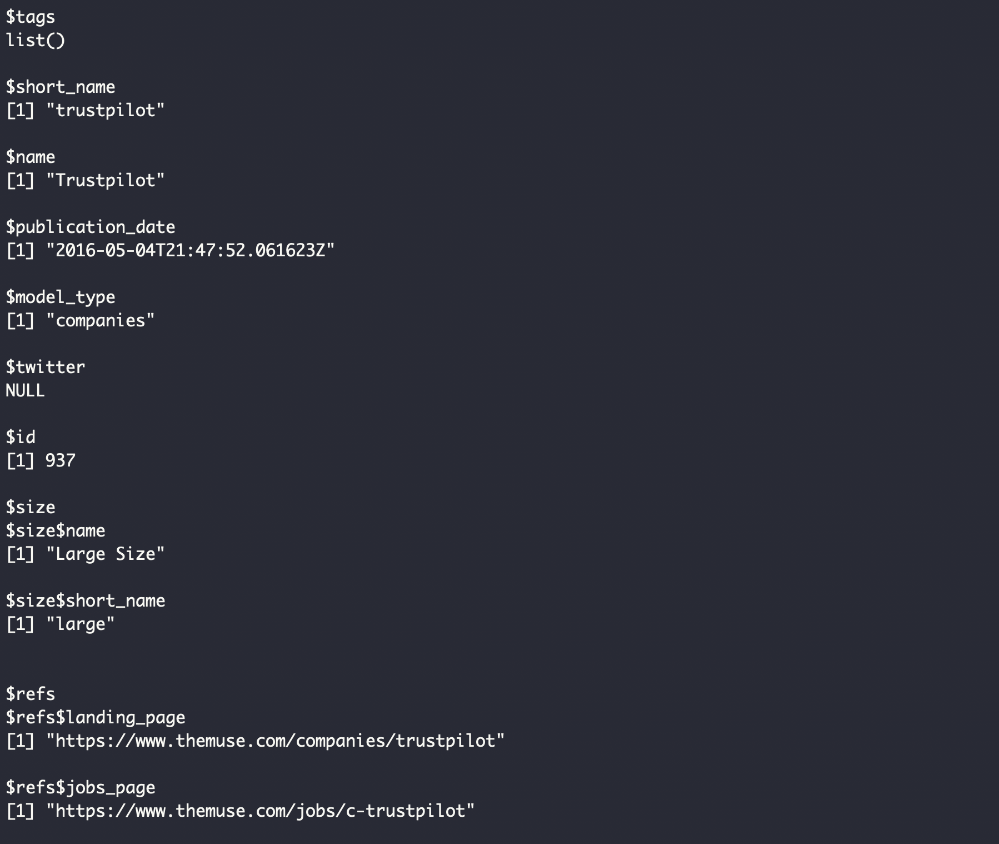
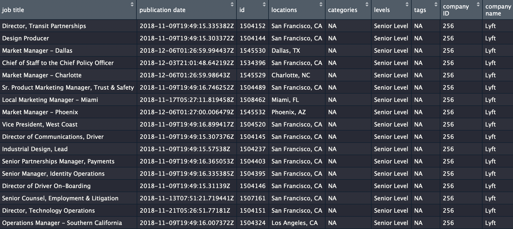

# Rmuse

THE MUSE is a  New York City-based online career source founded in 2011. It aims to offer job listings, company profiles, expert advice, skills-building 	resources, and coaching services to the millions of candidates using the platform.
The Rmuse package provides several R functionalities for interacting with their API service, making it easy to make API calls and process the response into convenient, R-friendly data structures. See <https://www.themuse.com/developers/api/v2> for the THE MUSE API Documentation.

## Installation and Setup

You can install the latest version from CRAN as follow:

```r
install.packages('Rmuse')
```

Alternatively, if you've installed the devtools package, you can install the latest development version directly from Github.

```r
devtools::install_github('brandywwy/Rmuse')
```

## Basic Usage

This package contains eight functions to interact with MUSE API. The first four aim to get a list of items (eg.jobs, companies, advice posts and coaches) with many related information, filtered by several criteria specified by you (as long as you input the parameters in proper style). They will return responses in JSON format and then no further coercion is performed. So, you may have to use functions from the \code{jsonlite} package to extract the desired output.

These four functions include:
* `getjob()`
* `getcompany()`
* `getpost()`
* `getcoach()`

For detailed instructions of these functions, you can refer to the documentation of them excuting the code below in the console:

```r
?funcution_name
## or by
help(function_name)
```

Below is an example:

```r
example1 <- getcompany(page = 1, industry = "Tech", size = "Large Size", location = "New York City, NY")
example1$results[[1]] ## since the there are too many companies, we just present the first one.
```



The other four functions are more convinient and is very helpful for users who are not familiar with \code{jsonlite} package or just do not to want to waste time to clean and save the dataframe. These functions are designed to return a clean dataframe filled by parsed responses from the specific MUSE API request for certain items (eg.jobs, companies, advice posts and coaches). The dataframes they return include almost all information in the original JSON responses except some repetitive information or some denpency links. It will directly show the dataframe to you as long as you input the parameters in proper style.

These four functions include:
* `cleanjob()`
* `cleancompany()`
* `cleanpost()`
* `cleancoach()`

For detailed instructions of these functions, you can refer to the documentation of them excuting the code below in the console:

```r
?funcution_name
## or by
help(function_name)
```

Below is an example:

```r
cleanjob(page = 1,company = "Lyft", level = "Senior Level")
```



## Authorization

The MUSE API does not nessarily require API key, you can use the API or functions in this package directly. However, if you don't register and provide an API key in query parameter, they will be limited to 500 requests per hour. If you apply an API key and pass it to the query parameter, you will be able to raise the limitation of requests from 500 to 3600 per hour.

If you want to register for the API key, please [click here](https://www.themuse.com/developers/api/v2/apps) and follow the instructions.

## Proper Expressions for the Arguments

As mentioned above, if you pass improper arguments to the function, it may return errors or unmatched results. Though some of the functions in this package are designed to warning you when you input improper arguments, in order to get exactly what you want, please check whether the arguments you will pass do exist through this [link](https://www.themuse.com/developers/api/v2) and click the labels that you want to get details about. 

__Have fun playing with MUSE API and hope this package can help you in some way!__

